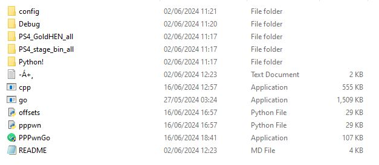
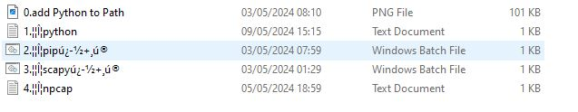
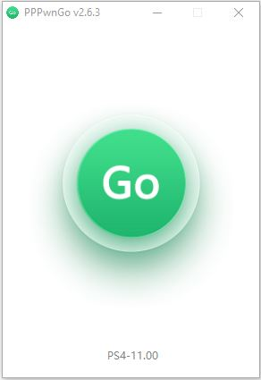
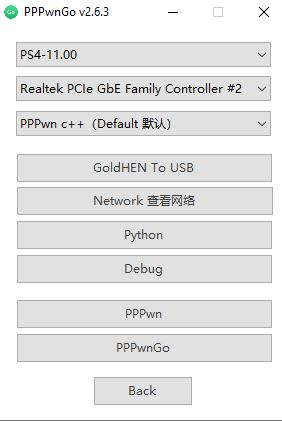
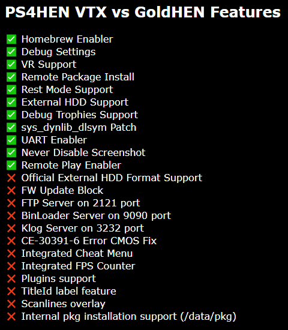

# PPPwnGo-Guide    
This guide is only for Windows    
Download and unzip [PPPwnGo](https://github.com/PSGO/PPPwnGo/releases/tag/v2.8.0)       
1. If your browser stops the download keep the file   
2. if Windows Defender flags the zip or any files allow them through 
This is because GUI  tools house the exploit pppwn which is known by security software https://hackerone.com/reports/2177925       
# Go inside the Python! folder     
  

    

# Installing dependencies Python      
       
Ignore if you only want to run the C++ version   
1. Take notice of the needed boxes that need to be checked for Python to function properly   
2. Download the latest Python installer from the link in the 1.¦¦Î¦python txt  or https://www.python.org/downloads/windows/       
    
	 
3 Run the *2* Batch files    
4. Download and install npcap from the link in the 4.¦¦Î¦npcap txt or https://npcap.com/dist/npcap-1.79.exe    
    
# Installing dependencies C++  
1. Download and install npcap from the link in the 4.¦¦Î¦npcap txt or https://npcap.com/dist/npcap-1.79.exe        
           
     
# GUI layout       
Run PPPwnGo application as admin   
     
At the bottom middle PS4-11.00 is from where you can open the settings menu  
     
1. The first dropdown menu is used to choose the firmware version of the exploit you want to use they range *7.00* to *11.00*     
NOTICE *9.00 9.60 10.00 10.01 11.00* are Goldhen the rest are PS4HEN VTX    
2. The second dropdown menu is used to set the ethernet adapter on your computer   
3. The third dropdown menu is used to choose which version of pppwn to run     
Choose between   
1. C++ (default)  
2. PPPwn Go rewrite   
3. Python  
Goldhen to USB - Opens the folder which has Goldhen payloads    
Network - Opens your network settings    
Python - Opens the Python folder    
Debug - Opens the recent terminal outputs    
PPPwn - Opens The TheOfficialFloW github pppwn page   
PPPwnGo - Opens the PPPwnGo github   
     
     
# Setting up the PS4 internet connection  
On your PS4  
1. Go to **Settings** and then **Network**   
2. Select **Set Up Internet connection** and choose Use a **LAN Cable**  
3. Choose **Custom** setup and choose **PPPoE** for IP Address Settings  
4. Put in *ppp* as **Username** and ***Password***  (Or the previosly chosen Username and Password if defaults were changed)  
5. Choose **Automatic** for *DNS Settings* and *MTU Settings*
6. Choose **Do not use** for *Proxy Server*   
7. Go back and be ready to press on *Test internet connection*        

# Putting the goldhen or VTX payload on a usb   
Format a usb drive to exFAT   
In PPPwnGO settings choose *GoldHen to USB*    
Find the folder for your firmware and from inside of it copy the goldhen.bin file onto your usb drive  for Goldhen         
Find the folder for your firmware and from inside of it copy the payload.bin file onto your usb drive  For VTX      
Then plug the usb into your PS4    

# Running the exploit Python    
From the 3rd dropdown menu in settings choose *the PPPwn python* option    
Press on *Back*   
Press on the big green *GO* button   
A cmd window will open and the exploit will start     
IF it becomes stuck on any point such as    
[*] Sending LCP configure request...    
[*] Waiting for LCP configure ACK...    
[+] Heap grooming...     
or   
[+] Scanning for corrupted object...failed   
close the cmd window and start over the exploit proccess including -       
7. Go back and be ready to press on *Test internet connection*       
     
     
# Running the exploit C++    
From the 3rd dropdown menu in settings choose *the PPPwn c++ (Stable)* option      
Press on *Back*   
Press on the big green *GO* button   
No new windows will open but in the app a small terminal will start outputting data     
IF it becomes stuck on any point such as    
[*] Sending LCP configure request...    
[*] Waiting for LCP configure ACK...    
[+] Heap grooming...     
or   
Press on *Stop* at the bottom middle and restart the proccess including -   
7. Go back and be ready to press on *Test internet connection*          
      
# Running the exploit C++ if you are getting console crashes or infinite loop       
From the 3rd dropdown menu in settings choose *the PPPwn c++ (Beta)* option      
Press on *Back*   
Press on the big green *GO* button   
No new windows will open but in the app a small terminal will start outputting data     
IF it becomes stuck on any point such as    
[*] Sending LCP configure request...    
[*] Waiting for LCP configure ACK...    
[+] Heap grooming...     
or         
Press on *Stop* at the bottom middle and restart the proccess including -     
7. Go back and be ready to press on *Test internet connection*           
    
# FAQ     
# What is the latest exploitable firmware?     
**11.00**       
    
# Can i downgrade if i am on *11.02-11.50*?     
Downgrading can be done under certain conditions         
1. You have not initialised the console on the current firmware        
2. You have not reinstalled system firmware to fix Hard Drive issues        
3. You have not replaced your Hard Drive and reinstalled the current system firmware         
4. Your Syscon must be A0X-COLX (X=Digits on your Syscon)       
**You can watch a full guide by [MODDED WARFARE](https://www.youtube.com/watch?v=JxeSP1PJtEs&t=764s)**          

     
# GOLDHEN PPPWN support     
**Current supported versions**       
*9.00*  *9.60* *10.00 10.01* and *11.00*           
    
# PS4HEN PPPWN support       
*7.00* to *11.00*      
Although it has less features than goldhen        
         
     
# Other guides       
# 1. [Guides Thread](https://github.com/DrYenyen/Guide-Links-For-PS4)                
# 2. [How to manually update PS4 firmware](https://github.com/DrYenyen/PS4-Firware-Update-Guide)                     
# 3. [How to install FPKGS](https://github.com/DrYenyen/How-To-Install-PS4-FPKGS)                  
# 4. [How to set up PPPwn on a OpenWRT compatible router(by FalsePhilosopher)](https://github.com/FalsePhilosopher/PPPwnWRT)           
# 5. [How to set up Raspberry-Pi on Windows for PPPwn](https://github.com/DrYenyen/PPPwn-Setup-Guide-For-Raspberry-Pi)      
# 6. [How-To-Use-Cheats-and-Patches-On-PS4](https://github.com/DrYenyen/How-To-Use-Goldhen-Cheats-and-Patches-On-PS4)        
      	   
		   
		   
		   